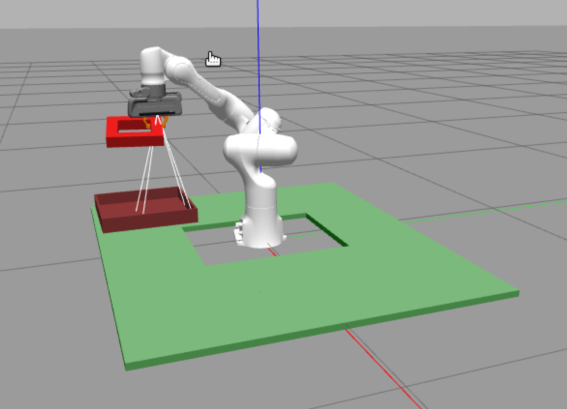
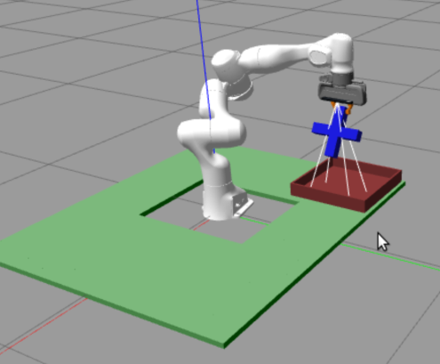
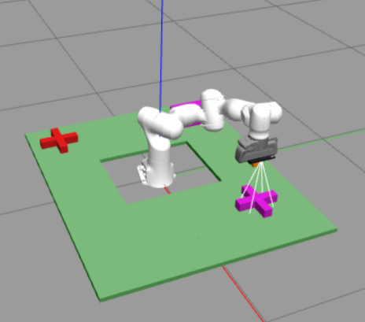
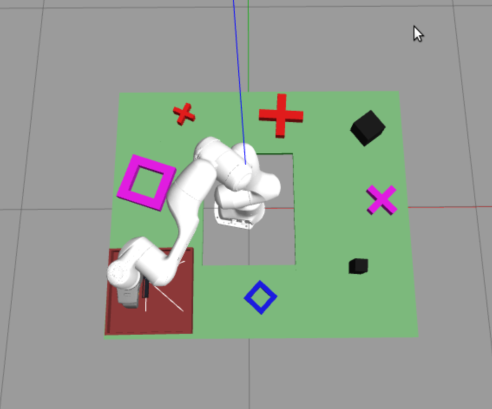

# COMP0250 Coursework 2: Pick and Place, Object Detection, and Localization Team 11

Team Number: 11

Authors:
- Yuze Bai ucabaci@ucl.ac.uk 
- LeTong Li 
- Yang Dong

---

## Overview
This coursework involves robot manipulation tasks using ROS, Gazebo, MoveIt!, and PCL for object detection, pick-and-place operations, and obstacle avoidance.

---

## Dependencies

- ROS Noetic
- MoveIt!
- Gazebo
- OpenCV
- PCL
- Octomap

To install dependencies:
Download the repository and add it as a package in your catkin environment (in /src folder). To build the package run in one terminal:

```console
    catkin build
```

To test and run the code, use the launch script:
```console
   source devel/setup.bash
   roslaunch cw2_team_11 run_solution.launch
```
---

### Starting Tasks
Run individual tasks using:
- Task 1: `rosservice call /task 1`
- Task 2: `rosservice call /task 2`
- Task 3: `rosservice call /task 3`

---

## Tasks

### Task 1: Pick and Place
- Description: Pick and place a given shape into a basket.
- Time Spent:  80 hours
- Team Contribution: Yuze Bai: 40%, Letong Li: 40%, Yang Dong: 20%.
- Screenshot: 



- Log Example:


### Task 2: Shape Detection
- Description: Identify which reference shape matches the mystery shape.
- Time Spent: 50 hours
- Team Contribution: Yuze Bai: 40%, Letong Li: 30%, Yang Dong: 30%.
- Screenshot: 
- Log Example:

```console
[ INFO] [1743980229.802294897, 35.459000000]: Ref Shape1: cross | Ref Shape2: nought | Mystery: cross
[ INFO] [1743980229.802308272, 35.459000000]: Mystery belongs to reference #1
```


### Task 3: Planning and Execution
- Description: Count shapes, determine the most common shape, and place it into a basket while avoiding obstacles.
- Time Spent: 85 hours
- Team Contribution: Yuze Bai: 90%, Letong Li: 10%, Yang Dong: 0%.
- Screenshot: 
- Log Example:
```console
[ INFO] [1743984466.220129901, 318.880000000]: Task3 => total=5, most_common=3
```
---

## Notes
- All nodes launch from `run_solution.launch`.
- Only standard ROS libraries used.

---

## License
This project is MIT licensed.
